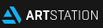

<!---
--->
 

 

 

 
 

 <!--TELEGRAM-->
 

 
 <!--EMAIL-->
 
  <!--DISCORD  -->
  
  

  

<!--REDDIT-->
  
   <!--LINKEDIN-->
    
   

 
  ### That's all folks! 👋
 
   

 
 

  
  
  ## Linguagens em progresso:
  

   <!--HTML-->
   
     
   
     
   <!--CSS  -->
   
  
   
<!--JAVASCRIPT  -->
   
   
   
   <!--C  -->
   
  
   
   <!--MARKDOWN -->
   
   
   
   

 
  <!--DEEZER
  

  

 -->

 

  <!--- 📫 [Email](mailto:pamrod100@gmail.com "Fale comigo") | [LinkedIn](https://www.linkedin.com/in/pamela-rodrigues-992024229/ "Conecte comigo") -->

  

  
<!-- Contador de visitas-->
 
 <!--/div>

<!-- 
________________________________________________________________________
AVISO:

"***" É uma dica/lembrete

"XXX" Significa algo que tentei fazer mas NÃO deu certo (para tentar denovo de outra forma)
_________________________________________________________________________
_________________________________________________________________________

======== Anotações de markdown language ========

*** Usar "mailto:" antes do email para encaminhar para a caixa de entrada/mensagens
***Após o link usar um texto entre aspas "texto bebê" faz aparecer a mensagem ao colocar o mouse sobre o link

XXX ?target=blank Tentando abrir o link em nova aba

_________________________________________________________________________________
====== Dicas do perfil ======

*** 1400x425 banner do github Vou usar 1400x222
*** pexels imagens royalty free

_________________________________________________________________________________
===== Códigos úteis de terceiros =====
Padrão HTML
 LINK <a href="https://t.me/ppz93">
 LINK IMG  
 FECHA LINK E IMG </a>

//EXEMPLO DE TABELA COM ICONES
## My Skill Set  
<table><tr><td valign="top" width="33%">

### Frontend  

  
  
  
  
  
  
  
  
  
  
  
  
  
  

</td><td valign="top" width="33%">

### Backend  

  
  
  
  
  
  
  
  
  
  
  

</td><td valign="top" width="33%">

### DevOps  

  
  
  
  
  

</td></tr></table>  

 //FAZ O LETREIRO LUMINOSO

//FAZ O CONTADOR DE VISITAS 

 -->

<!--
//STATUS (https://github.com/pierrete/github-readme-stats)
//LINGUAGENS 

# Top 5 Badges That Will Take Your GitHub Repository to the Next Level

## 1. GitHub Stats--------------------------------------------------------------------

## 2. Most Used Languages--------------------------------------------------------------------

## 3. Contributors BadgeMade with [contributors-img](https://contrib.rocks).--------------------------------------------------------------------

## 4. Random Joke Generator## 😂 Here is a random joke that'll make you laugh!--------------------------------------------------------------------

## 5. Profile View Counter### HITS

__________________________________________________________________________________
===== Github profile default =====

**pierrete/pierrete** is a ✨ _special_ ✨ repository because its `README.md` (this file) appears on your GitHub profile.

Here are some ideas to get you started:

- 🔭 I’m currently working on ...
- 🌱 I’m currently learning ...
- 👯 I’m looking to collaborate on ...
- 🤔 I’m looking for help with ...
- 💬 Ask me about ...
- 📫 How to reach me: ...
- 😄 Pronouns: ...
- ⚡ Fun fact: ...
-->
